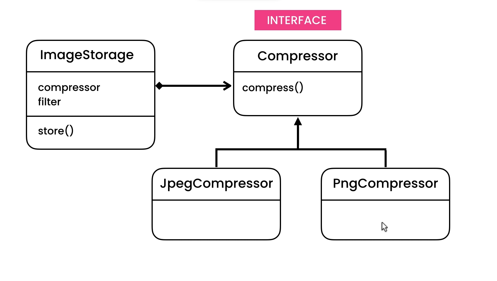
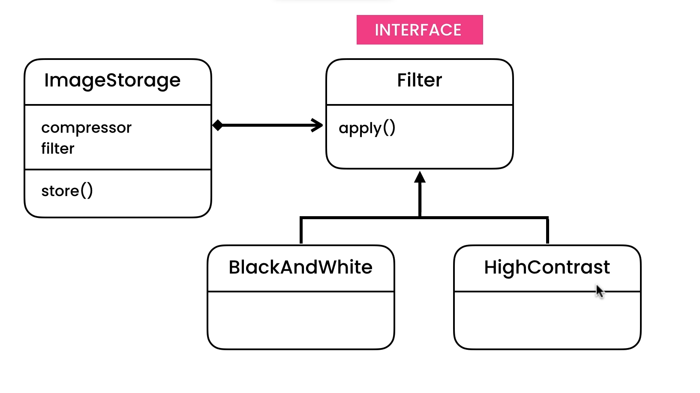
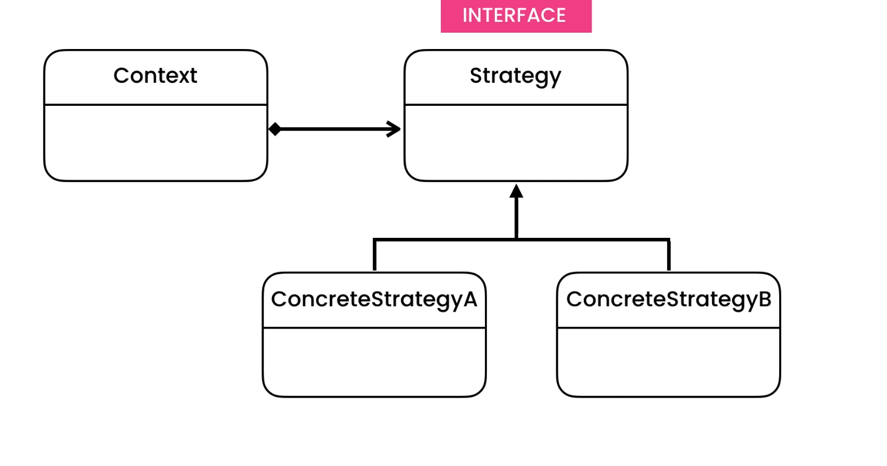

### The problem? 😖

In our ImageStorage class we are having two problems, one is we are violating the single responsibility principle, because it's not only responsible for storing a image, but also responsible
for compressing and applying filter for the image. in this example, we have simple print statements,
but in real example we will have a method that we will call for compressing images, which will be probably twenty lines or more. Now, as we add more
compression algorithms and filters, our class will become bulky and harder to maintain.

 
Another problem is that, it will be difficult to extend this class and support new
compression algorithms and new filters, as we have to change existing code in different parts of this class
and overtime this will get harder and harder to maintain

### The solution 🥳
To solve this problem we can apply polymorphism principle of OOP, so depending on the compression and filter, our ImageStorage class will behave differently.

so we can create a Compressor interface with a single compress method and have concrete classes implement these interfaces such as JpegCompressor, PNGCompressor and so on.
if tomorrow we want to support new compression algorithm, we can create a new class and implement compressor interface. we follow open/closed principle here. so we can extend application by adding a new class and not by changing existing one.

same is true for Filtering, we again follow open-closed principle, so we can extend application easily

This pattern is called strategy pattern

Strategy is a behavioral design pattern that lets you define a family of algorithms, put each of them into a separate class, and make their objects interchangeable.

* The Strategy pattern is based on the idea of encapsulating a family of algorithms into separate classes that implement a common interface. The pattern consists of three main components: the Context, the Strategy, and the Concrete Strategy.

* The Context is the class that contains the object whose behavior needs to be changed dynamically. The Strategy is the interface or abstract class that defines the common methods for all the algorithms that can be used by the Context object. The Concrete Strategy is the class that implements the Strategy interface and provides the actual implementation of the algorithm.

* To use the Strategy pattern, you first create a Context object. Then, you create one or more Concrete Strategy objects that implement the Strategy interface. Finally, you set the Strategy object for the Context object by calling its setStrategy() method. At runtime, the Context object uses the selected Concrete Strategy object to perform its operations.

In our example, Context is ImageStorage, Strategy is Compressor Interface and ConcreteStrategyA and ConcreteStrategyB are JpegCompressor and PNGCompressor

Resources:
1. https://refactoring.guru/design-patterns/strategy
2. https://www.geeksforgeeks.org/strategy-pattern-set-1/